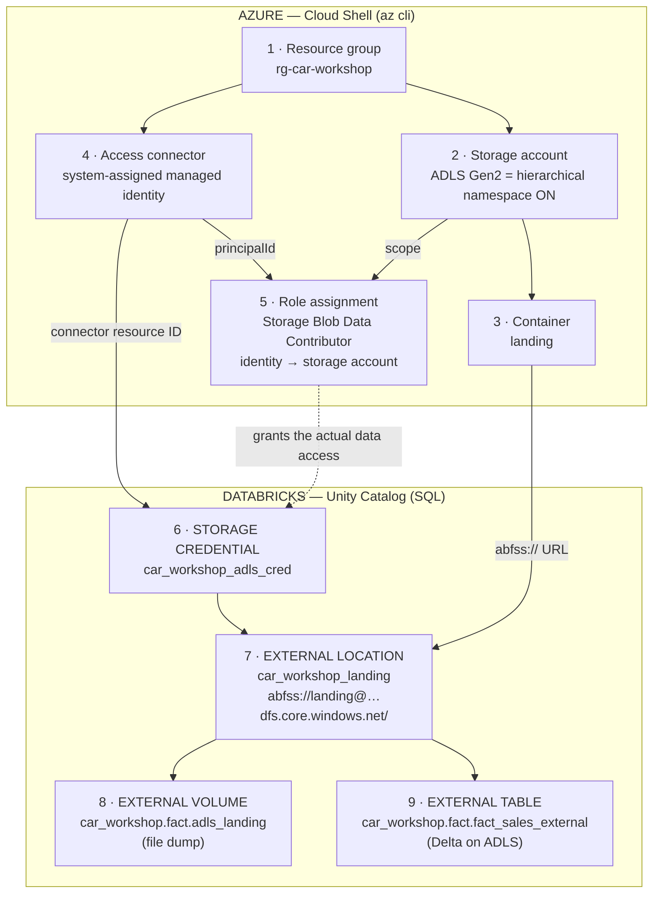

# ADLS Gen2 + Unity Catalog — end-to-end setup (Azure Cloud Shell)

Goal: use an ADLS Gen2 storage account as a **file dump** (external volume) and as an
**external table location** for the `car_workshop` catalog. The Azure side is done
entirely from [Cloud Shell](https://shell.azure.com) (browser bash, `az` preinstalled,
already logged in — nothing to install locally). The Databricks side is
[`create_external_adls.sql`](create_external_adls.sql).

## Chain of events

Every arrow below is "must exist before". The whole thing is one dependency chain:
Azure builds the identity + storage, Unity Catalog wraps them in governed objects.



How a read works afterwards: query → UC checks your grants on the table/volume →
UC resolves external location → storage credential → access connector's managed
identity → Azure RBAC lets it read the blobs. No keys, no secrets, no Spark conf.

## Azure side — paste into Cloud Shell block by block

```bash
# ---- variables (adjust once) ----
LOCATION=westeurope
RG=rg-car-workshop
SA=carworkshopadls$RANDOM   # globally unique, 3-24 chars, lowercase+digits only
AC=ac-car-workshop
CONTAINER=landing

# ---- 0. sanity: which subscription am I in? ----
az account show -o table
# wrong one?  az account list -o table && az account set --subscription "<name-or-id>"

# ---- 1. resource group ----
az group create --name $RG --location $LOCATION

# ---- 2. storage account (ADLS Gen2 = HNS enabled!) ----
az storage account create \
  --name $SA \
  --resource-group $RG \
  --location $LOCATION \
  --sku Standard_LRS \
  --kind StorageV2 \
  --enable-hierarchical-namespace true \
  --min-tls-version TLS1_2 \
  --allow-blob-public-access false

# ---- 3. container ----
az storage container create --account-name $SA --name $CONTAINER

# ---- 4. access connector (managed identity UC will use) ----
az extension add --name databricks
az databricks access-connector create \
  --name $AC \
  --resource-group $RG \
  --location $LOCATION \
  --identity-type SystemAssigned

# ---- 5. let that identity touch the storage account ----
PRINCIPAL_ID=$(az databricks access-connector show -n $AC -g $RG --query identity.principalId -o tsv)
SA_ID=$(az storage account show -n $SA -g $RG --query id -o tsv)

az role assignment create \
  --assignee-object-id $PRINCIPAL_ID \
  --assignee-principal-type ServicePrincipal \
  --role "Storage Blob Data Contributor" \
  --scope $SA_ID

# ---- 6. print what the SQL script needs ----
echo "storage account : $SA"
echo "connector id    : $(az databricks access-connector show -n $AC -g $RG --query id -o tsv)"
```

## Handover to Databricks

Take the two values printed in step 6 and plug them into
[`create_external_adls.sql`](create_external_adls.sql):

| value from Cloud Shell | goes into |
| --- | --- |
| storage account name | every `abfss://landing@<SA>.dfs.core.windows.net/...` URL |
| connector resource ID | `ACCESS_CONNECTOR_ID` in `CREATE STORAGE CREDENTIAL` |

Then run that script top-to-bottom: credential → external location → smoke-test
`LIST 'abfss://...'` → external volume → external table.

## Pitfalls

- **Storage account name is globally unique** across all of Azure — hence `$RANDOM`.
  Lowercase letters + digits only, no hyphens.
- **`--enable-hierarchical-namespace true` cannot be changed later.** Without it you
  get plain Blob Storage, not ADLS Gen2, and UC refuses it. Forgot? Delete and recreate.
- **RBAC propagation lag** — the role assignment from step 5 can take 2–5 minutes to
  take effect. A `403` from `CREATE EXTERNAL LOCATION` or `LIST 'abfss://...'` right
  after setup usually means "wait", not "broken".
- Step 3 may warn about using the account key for auth — as subscription owner you can
  list keys, so it works; safe to ignore.
- `DROP TABLE` on an external table removes only the metastore entry — **files on ADLS
  stay**. Clean the path manually before recreating.
- Paths must not overlap: a volume cannot live inside a table location (or vice versa),
  and external locations cannot overlap each other.

## Cost & cleanup

LRS storage with no data + access connector ≈ pennies. Tear everything down with:

```bash
az group delete --name rg-car-workshop
```

(UC objects survive as dangling metadata — drop them with `DROP EXTERNAL LOCATION` /
`DROP STORAGE CREDENTIAL` if you rebuild.)
