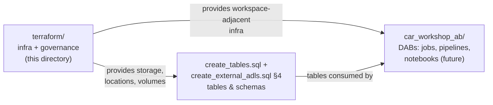

# Terraform manual — ADLS Gen2 + Unity Catalog from zero

This walks through building the whole [setup_adls_azure.md](../infra/setup_adls_azure.md)
chain as code: from an empty folder, file by file, to `terraform apply` and teardown.
The files described here already exist in this directory — the manual explains what
each one is for and in what order you would create them yourself.

**Scope rule:** Terraform owns *infrastructure + governance* (storage, identity,
RBAC, storage credential, external location, volume, grants). Tables stay in SQL —
schema evolution belongs to pipelines, not to infra code.

```text
terraform/
├── versions.tf               required terraform + provider versions
├── providers.tf              how each provider authenticates
├── variables.tf              all inputs, with defaults where sane
├── terraform.tfvars          your values (gitignored; see .example)
├── main.tf                   the actual resources
├── outputs.tf                values printed after apply
└── .gitignore                state + tfvars stay local
```

---

## 0. Prerequisites (one-time, on your Mac)

```bash
# Terraform itself
brew tap hashicorp/tap
brew install hashicorp/tap/terraform
terraform -version          # expect >= 1.5

# Azure CLI + login (opens a browser)
brew install azure-cli
az login
az account show -o table    # verify you're in the right subscription
```

You also need:

- a Databricks workspace **attached to a Unity Catalog metastore**,
- your user having `CREATE STORAGE CREDENTIAL` + `CREATE EXTERNAL LOCATION`
  on that metastore (metastore admin has both),
- the `car_workshop` catalog + `fact` schema already existing
  (Terraform creates the volume *in* them, not them — that's `create_tables.sql`).

> **Already ran `create_external_adls.sql`?** Then the credential / external
> location / volume exist and `apply` will fail with "already exists".
> Either drop them first, or adopt them into state — see
> [Troubleshooting](#7-troubleshooting).

---

## 1. File by file — what and why

Order matters conceptually (each file builds on the previous), though Terraform
itself reads all `*.tf` files in a directory as one big blob.

### 1.1 `versions.tf` — pin your tools

The `terraform {}` block declares which providers this config needs and which
versions are acceptable. `~> 4.0` means "any 4.x, never 5.x" — provider major
versions break things (azurerm 4.x changed authentication vs 3.x), so an
unpinned config can stop working on a random future `init`.

Four providers: `azurerm` (Azure resources), `databricks` (UC objects),
`random` (storage account name suffix), `time` (RBAC propagation buffer).

### 1.2 `providers.tf` — how Terraform logs in

Both providers piggyback on your `az login` session — no secrets in code:

- `azurerm` additionally needs `subscription_id` explicitly (a 4.x requirement),
- `databricks` gets `host` (your workspace URL) and `auth_type = "azure-cli"`,
  meaning: act as the Azure-logged-in user against that workspace.

This is the sandbox setup. In CI you would swap `az login` for a service
principal / OIDC — the resources stay identical, only this file changes.

### 1.3 `variables.tf` — the knobs

Every value that could differ between environments is a variable. Two have no
default and **must** be provided (subscription id, workspace URL); the rest
default to the names used across this repo. This is what makes a second
environment free: same code, different `tfvars`.

### 1.4 `terraform.tfvars` — your values

```bash
cp terraform.tfvars.example terraform.tfvars
```

Fill in:

```bash
az account show --query id -o tsv     # -> subscription_id
```

Workspace URL: browser address bar in Databricks, up to and including
`azuredatabricks.net`. The file is gitignored — it identifies your environment.

### 1.5 `main.tf` — the resources

Mirrors the Cloud Shell script 1:1, plus the UC objects from the SQL script:

| # | resource | replaces |
| --- | --- | --- |
| 1 | `azurerm_resource_group.this` | `az group create` |
| 2 | `random_string.sa_suffix` | `$RANDOM` in the shell script |
| 3 | `azurerm_storage_account.adls` (`is_hns_enabled = true`) | `az storage account create` |
| 4 | `azurerm_storage_container.landing` | `az storage container create` |
| 5 | `azurerm_databricks_access_connector.uc` | `az databricks access-connector create` |
| 6 | `azurerm_role_assignment.connector_blob_contributor` | `az role assignment create` |
| 7 | `time_sleep.rbac_propagation` | you, waiting 2 minutes before retrying |
| 8 | `databricks_storage_credential.adls` | `CREATE STORAGE CREDENTIAL` |
| 9 | `databricks_external_location.landing` | `CREATE EXTERNAL LOCATION` |
| 10 | `databricks_volume.adls_landing` | `CREATE EXTERNAL VOLUME` |

The key thing to notice: **there is no manual handover anymore.** The connector
resource ID flows into the credential as
`azurerm_databricks_access_connector.uc.id`; the storage account name flows into
the `abfss://` URL as an interpolation. Terraform derives the creation order
from these references — you never tell it "run step 5 before step 8".

The only *explicit* ordering is `depends_on = [time_sleep.rbac_propagation]` on
the external location: creating it validates access immediately, and Azure RBAC
takes a couple of minutes to propagate. That's not a reference Terraform could
infer, so it has to be stated.

### 1.6 `outputs.tf` — what you get back

After `apply`, Terraform prints the generated storage account name, the
connector ID, the governed `abfss://` URL and the ready-to-use
`/Volumes/car_workshop/fact/adls_landing` path.

---

## 2. Initialize

```bash
cd terraform
terraform init
```

What happens: providers are downloaded into `.terraform/` (gitignored) and
`.terraform.lock.hcl` is written — the exact provider builds, analogous to a
package lock file. **Commit the lock file**, never `.terraform/`.

Then two cheap habits:

```bash
terraform fmt        # canonical formatting
terraform validate   # catches typos, bad references, wrong argument names
```

---

## 3. Plan — read before you apply

```bash
terraform plan
```

The plan is the whole point of Terraform: a diff between your code and reality.
First run should end with **`Plan: 10 to add, 0 to change, 0 to destroy.`**
Things worth actually reading in the output:

- `is_hns_enabled = true` on the storage account (the un-fixable-later flag),
- the role assignment scoped to the storage account,
- `(known after apply)` markers — values that depend on other resources,
  which is the dependency graph made visible.

Nothing has been created yet. `plan` is always safe.

---

## 4. Apply

```bash
terraform apply      # shows the plan again, type: yes
```

Takes ~3–5 minutes; the visible pause in the middle is `time_sleep` doing its
job. When it finishes:

```bash
terraform output
```

A `terraform.tfstate` file appears — Terraform's record of what it manages.
Local state is fine for a one-person sandbox; teams keep it remotely (in Azure:
a blob container + state locking). Never commit it, never hand-edit it.

Verify from Databricks:

```sql
LIST 'abfss://landing@<storage_account_name from output>.dfs.core.windows.net/';
```

```python
dbutils.fs.ls('/Volumes/car_workshop/fact/adls_landing/')
```

External *tables* on this location remain a SQL job — section 4 of
[create_external_adls.sql](../infra/create_external_adls.sql), with the storage
account name from `terraform output`.

---

## 5. Day-2 operations — where Terraform earns its keep

**Idempotency.** Run `terraform plan` again: `No changes.` Same code, same
infra, nothing to do.

**Drift detection.** Change something in the Azure portal (e.g. add a tag to
the storage account), then `terraform plan` — it shows the drift and offers to
revert it. Reality is now being compared against code, continuously.

**Evolution.** Want a second container + external location for exports? Add
two resources, `plan` shows `2 to add`, `apply`. No clicking, and the change
is reviewable in a PR.

---

## 6. Teardown

```bash
terraform destroy    # type: yes
```

Destroys in reverse dependency order (volume → external location → credential →
role assignment → connector → container → storage account → RG), which is
exactly why the manual reset in the main README can't be beaten by hand for
completeness. Rebuild afterwards with a single `apply`.

Partial teardown works too:

```bash
terraform destroy -target=databricks_volume.adls_landing
```

---

## 7. Troubleshooting

| symptom | cause | fix |
| --- | --- | --- |
| `subscription_id is a required provider property` | azurerm 4.x | fill `subscription_id` in `terraform.tfvars` |
| `401/403` from the databricks provider | not logged in / wrong workspace URL / no metastore privileges | `az login`; check URL; you need CREATE STORAGE CREDENTIAL + CREATE EXTERNAL LOCATION on the metastore |
| external location fails `PERMISSION_DENIED` on abfss | RBAC not propagated yet | wait, `apply` again (idempotent); or raise `time_sleep` duration |
| `... already exists` for credential/location/volume | objects created earlier via `create_external_adls.sql` | drop them in SQL, or adopt into state: see imports below |
| storage account name taken | prefix+suffix collided (rare) | `terraform apply` again re-rolls nothing — change `storage_account_prefix` |
| `Error: Inconsistent dependency lock file` | providers changed since init | `terraform init -upgrade` |

Adopting pre-existing UC objects instead of recreating them:

```bash
terraform import databricks_storage_credential.adls  car_workshop_adls_cred
terraform import databricks_external_location.landing car_workshop_landing
terraform import databricks_volume.adls_landing       car_workshop.fact.adls_landing
```

After each import, `terraform plan` shows how the real object differs from the
code — align the code until `No changes`.

---

## 8. How this maps to the rest of the repo



One sentence to remember for architect interviews: **Terraform owns what
platform teams own (infra + governance), DABs own what data teams deploy
(workloads), and table DDL travels with the pipelines that populate the
tables.**
